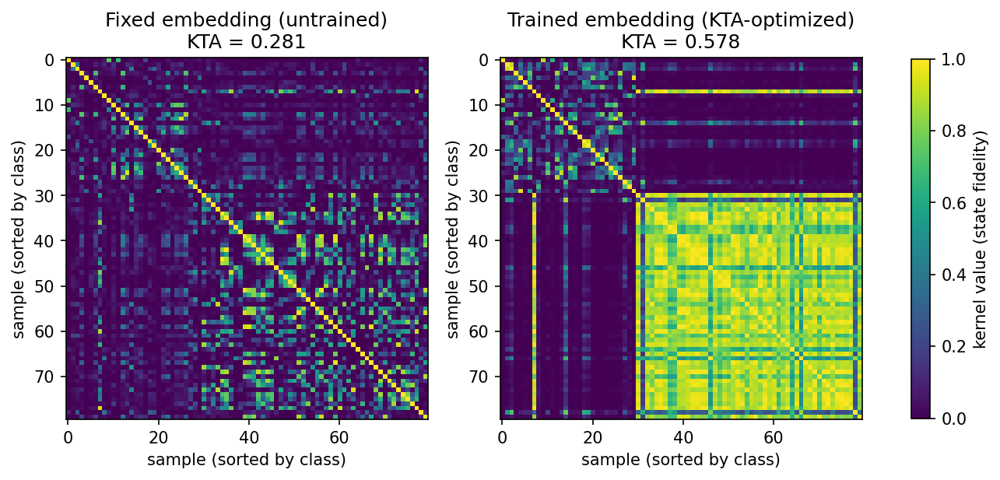
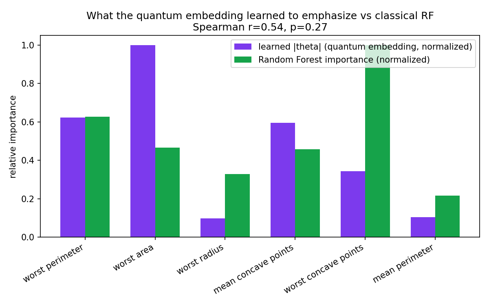

# Learned quantum feature embeddings

Second project after the credit risk one, this time going after Qinetic's
"Learned Quantum Feature Embeddings" line specifically - the idea that how
you encode classical data into a circuit should itself be trainable instead
of just picking a standard feature map (ZZFeatureMap etc) and hoping it
works.

## the idea

Instead of training a circuit end-to-end on a classification loss (that's
what the VQC in the credit risk project does), this trains the *encoding*
itself against kernel-target alignment (KTA) - basically nudge the
embedding so same-class points end up close together in Hilbert space and
different-class points end up far apart, measured by state fidelity. Once
that's optimized, a plain SVM gets dropped on top of whatever kernel comes
out. Different training signal than a classification loss entirely, which
is why I picked it over just doing "VQC round 2."

Circuit is a small data-reuploading embedding on 6 qubits: each feature
gets its own trainable scale + bias, reapplied across 3 layers with an
entangling ring of CZ gates between layers. The untrained version of this
same circuit (scale=1, bias=0, i.e. features just go in raw) is what I'm
using as the "fixed / hand-picked feature map" baseline, so it's an honest
apples to apples comparison - same architecture, only difference is
whether the encoding got trained.

## dataset

Breast Cancer Wisconsin (built into sklearn, 569 patients, 30 features,
malignant/benign). Picked a different dataset than the credit project on
purpose, and this one's a common benchmark in QML papers so it's easy to
sanity check whether my numbers are in a reasonable ballpark. Cut down to
the top 6 features by mutual information since 6 qubits is about the limit
for statevector simulation to still run fast on a normal CPU.

## results

| | KTA score | downstream SVM balanced accuracy |
|---|---|---|
| fixed embedding (untrained) | 0.281 | 0.877 |
| **trained embedding** | **0.578** | **0.909** |
| Random Forest (same 6 features, for reference) | - | 0.904 |

Training the embedding roughly doubled the alignment score, which is what
KTA is directly optimizing for so not hugely surprising on its own - the
part I didn't expect going in was that the resulting kernel's downstream
SVM accuracy actually edged out the Random Forest. One dataset, one seed,
6 qubits - not claiming this generalizes, but it's a real result and
different from how the credit risk project went (classical won there).



Sorted by class label, so the trained embedding visibly develops the
block-diagonal structure you'd want (same-class pairs bright, cross-class
pairs dark) while the fixed one is close to uniform - basically watching
the alignment score turn into an actual picture.

### what did it learn to pay attention to

Compared the learned |theta| scale per feature (how much the optimizer
amplified vs suppressed each feature in the encoding) against Random
Forest's feature importances on the same 6 features.



Spearman correlation is 0.54 (p=0.27, not significant with only 6
features to rank, would need way more features to say anything solid
here). Rough agreement but not a copy of the classical ranking - it
upweighted "worst area" a lot more than RF did and mostly ignored "worst
radius" and "mean perimeter," which RF also ranked low but not *that*
low. Reads like the embedding found a somewhat different way of
weighting the same information rather than just reproducing the
classical importance order.

## running it

```
pip install qiskit scikit-learn scipy numpy matplotlib
python3 preprocess.py     # selects top 6 features, saves X.npy / y.npy
python3 experiment.py     # trains embedding, evaluates, saves results.json
```

Optimization step (COBYLA, 250 evals) took about 50s on my machine.
Everything is exact statevector simulation, no sampling noise and no
quantum hardware needed - which is also the biggest limitation, see below.

## limitations / what I'd want to check next

- exact statevector fidelity isn't something you get for free on real
  hardware, you'd need something like a swap test or the compute-uncompute
  trick, which brings in shot noise. worth checking whether the KTA
  training still converges to something useful once that noise is added
- only tried one architecture (3 layers, RY + CZ ring). didn't sweep
  layer count or entangling pattern, no idea if 3 layers is actually
  near-optimal or just what I happened to try first
- 6 qubits / 6 features is a hard ceiling for local simulation, so never
  got to see if the trained-vs-fixed gap holds up with more features -
  possible it's partly an artifact of the specific 6 that mutual info
  picked
- only one train/test split, would want to average over a few seeds
  before trusting the SVM beating Random Forest as a real effect and not
  a lucky split

## data source

Breast Cancer Wisconsin (Diagnostic) dataset, available directly through
`sklearn.datasets.load_breast_cancer()`.
